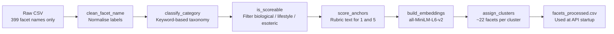
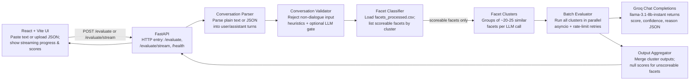

# Ahoum Conversation Evaluator

Ahoum evaluates multi-turn conversations across a large facet set, returning a score, confidence, and reason per facet. It clusters scoreable facets for scalable batch evaluation and ships a React UI with streaming progress updates.

## Live demo

**Deployed UI (Vercel):** https://300-dimension-dialogue-evaluation-f.vercel.app/

Open the link to paste or upload a conversation, run evaluation, and view streamed facet scores. The frontend connects to the hosted API on Render.

## Facet preprocessing (offline)

The raw assignment file (`data/Facets Assignment.csv`) contains **399 facet names only** — no categories, rubrics, or batch assignments. Before any conversation can be evaluated, we run `scripts/preprocess_facets.py` once to build `data/facets_processed.csv`, which the live API loads at startup.

| Step | What it does |
|------|----------------|
| **Clean names** | Strips numbering and whitespace → `facet_name_clean` |
| **Classify category** | Keyword rules assign personality, linguistic, emotion, cognitive, safety, social, biological, lifestyle, spiritual, or other |
| **Mark scoreable** | Flags facets that can be inferred from dialogue text. Biological/lifestyle/spiritual facets and pattern matches (e.g. FSH level, caffeine intake, passport stamps) → `scoreable: false` |
| **Difficulty & context** | Sets `evaluation_difficulty` and whether the full conversation is required (`requires_full_context`) |
| **Score anchors** | Generates `score_anchor_low` / `score_anchor_high` text so the LLM knows what 1 vs 5 means per category |
| **Cluster (KMeans)** | Embeds scoreable facet names with **sentence-transformers** (`all-MiniLM-L6-v2`, TF-IDF fallback), then **KMeans** groups ~20–25 similar facets per `cluster_id`. Unscoreable facets get `cluster_id: -1` |

```powershell
python scripts/preprocess_facets.py
# Writes data/facets_processed.csv
```

**Output columns:** `facet_name_clean`, `scoreable`, `category`, `evaluation_difficulty`, `requires_full_context`, `score_anchor_low`, `score_anchor_high`, `cluster_id`



## Architecture (runtime pipeline)

When a user evaluates a conversation, the API runs the pipeline below. Each box describes **what that component does**.



### Component reference

| Component | Module | Role |
|-----------|--------|------|
| **React + Vite UI** | `frontend/` | Collects input, calls the API, streams progress events, renders the score table, exports CSV |
| **FastAPI** | `api/main.py` | Routes requests, CORS, serves built frontend in Docker |
| **Conversation Parser** | `evaluator/conversation_parser.py` | Converts `role: message` text or flexible JSON (`messages`, `turns`, etc.) into a turn list |
| **Conversation Validator** | `evaluator/conversation_validator.py` | Blocks configs, code dumps, and non-dialogue text before any LLM scoring |
| **Facet Classifier** | `evaluator/facet_classifier.py` | Reads preprocessed facets; exposes scoreable facets grouped by `cluster_id` |
| **Facet Clusters** | `data/facets_processed.csv` | Precomputed KMeans groups — not recomputed per request |
| **Batch Evaluator** | `evaluator/batch_evaluator.py` | One Groq request per cluster; concurrent calls with 429 backoff |
| **Groq Chat Completions** | Groq API | Scores each facet in the batch using anchors from preprocessing |
| **Output Aggregator** | `evaluator/output_aggregator.py` | Combines all cluster JSON; fills unscoreable rows with `score: null`; returns `EvaluationResult` |

## Setup

### Local (Python + Node)

1. Create a `.env` from the example and add your Groq key:

```powershell
copy .env.example .env
```

2. Start the API:

```powershell
uvicorn api.main:app --reload --port 8000
```

3. Start the frontend:

```powershell
cd frontend
npm install
npm run dev
```

Open http://localhost:5173.

### Docker

```powershell
docker compose up --build
```

Open http://localhost:8080.

Stop with:

```powershell
docker compose down
```

## Why this scales to 5000 facets

- Only scoreable facets are clustered. Unscoreable facets are never sent to the LLM.
- Clusters are built with sentence-transformers (`all-MiniLM-L6-v2`, with TF-IDF fallback) and KMeans to keep semantically similar facets together.
- Clustering groups roughly 20 to 25 facets per batch, keeping each request small and stable.
- The number of clusters grows linearly with the number of facets, so capacity scales without redesign.
- Rate control is handled through batch size, concurrency, and request delay settings.

## Example JSON

### Input

```json
{
  "conversation_id": "demo-001",
  "raw_input": "user: How can I reset my password?\nassistant: Open Settings, then click Reset Password."
}
```

### Output (excerpt)

```json
{
  "conversation_id": "demo-001",
  "total_facets": 399,
  "scoreable_facets": 210,
  "scores": [
    {
      "facet_name": "clarity",
      "category": "linguistic",
      "score": 4,
      "confidence": 0.82,
      "reason": "The steps are concise and unambiguous.",
      "scoreable": true
    },
    {
      "facet_name": "domain_accuracy",
      "category": "cognitive",
      "score": 5,
      "confidence": 0.88,
      "reason": "Guidance matches common password reset flows.",
      "scoreable": true
    }
  ]
}
```

## Design decisions

- **Clustered evaluation**: scoreable facets are grouped and evaluated in batches for scalability.
- **Streaming UX**: `/evaluate/stream` emits progress events to keep the UI responsive.
- **Strict JSON output**: model output is constrained to JSON to reduce parsing failures.
- **Fail-safe aggregation**: unscoreable facets are filled with `score=None` and a default reason.

## Issues encountered and fixes

- **Groq rate limits (429)**: mitigated with lower concurrency, request delays, and batch size controls.
- **Invalid JSON from model**: added JSON-only prompt constraints and a tolerant JSON parser.
- **Streaming not visible in dev**: added a dedicated proxy for `/evaluate/stream`.

## Notes

- For free-tier Groq, keep concurrency at 1 and use small batch sizes.
- `MAX_CLUSTERS_PER_RUN` can limit runtime for demos, but it returns partial results.
